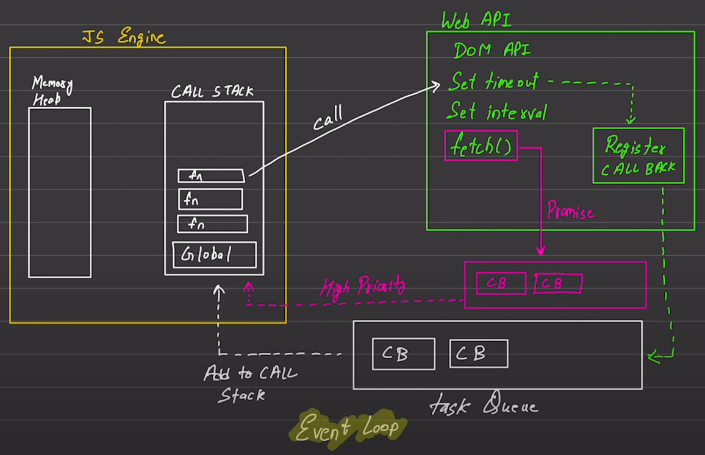

# Async

Originally JS is a synchronous, blocking, single-threaded language. That means only one process can run at a time.

To deal with this we have three options:

1. Asynchronous callbacks
2. Promises
3. Async/Await

